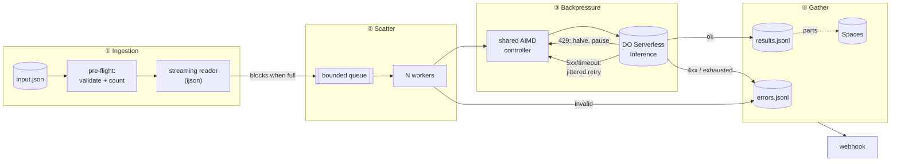

# Batch Inference Engine

**A self-tuning, crash-safe REST service that pushes large prompt files through LLM endpoints without losing a single item.**

Submit a JSON file of prompts and get a job ID instantly. In the background the engine streams the file through a bounded worker pool to DigitalOcean Serverless Inference. A shared controller adapts to the provider's rate limit on its own, like TCP congestion control. Every result is written to disk the moment it arrives. Bad rows are set aside as errors, crashes resume where they stopped, and memory stays flat whether the file holds 1,000 items or 500,000.

---

## 🏗️ Architecture



| Stage | What happens |
|---|---|
| **Ingestion** | `POST /job` returns a job ID instantly. A streaming pre-flight pass validates the JSON and counts the items **before any money is spent**, then the file is streamed again one item at a time. |
| **Scatter** | Items flow into a bounded queue (`QUEUE_SIZE=100`). When it is full, the reader waits, so it can never race ahead of the workers. This is the "chunking": a rolling window instead of fixed slices, so no worker ever idles waiting for the slowest item in its slice. |
| **Backpressure** | Every request needs a slot from **one controller shared by all workers**. A 429 halves the number of slots and successes grow it back. Each retry waits a random, exponentially growing delay (full jitter). |
| **Gather** | Each outcome is appended to `results.jsonl` / `errors.jsonl` as soon as it finishes. It is also uploaded to Spaces on a timer, and a webhook fires when the job completes. |

The full diagram, with every retry path and the crash-recovery loop, is in [docs/architecture.md](docs/architecture.md).

---

## 📊 Results at a glance

| | Result |
|---|---|
| 🚀 **Adaptive vs fixed concurrency** (fake API that limits *concurrent* requests) | **6.9× faster, 137× fewer 429s**: 10.4 s vs 71.6 s, 6 vs 820 rejections ([evidence](docs/benchmarks/adaptive-vs-fixed/)) |
| 🧠 **500,000 items** | Memory **flat at ~60 MB** from the first item to the last. A plain `json.load` of the same file needs 295 MB before doing any work. ([evidence](docs/benchmarks/500k/)) |
| ☁️ **Real DigitalOcean run** (1,000 prompts, `mistral-3-14B`) | **993 ok + 7 bad rows isolated, 0 lost**, through **765 real 429s**, for **$0.016** ([evidence](docs/benchmarks/real-do-run/)) |
| 💥 **`kill -9` mid-job** | Resumed automatically on restart: exactly 1,000 unique results, no loss, no duplicates ([evidence](docs/benchmarks/crash-recovery/)) |
| ✅ **Quality** | 80 offline tests (46 unit + 34 integration), lint, CI on Python 3.11 / 3.12 / 3.13 |

---

## 📚 Contents

[Quickstart](#quickstart) | [API](#api) | [How it works](#how-it-works) | [Scale thresholds](#scale-thresholds) | [Real DigitalOcean run](#real-digitalocean-run) | [Extensions](#extensions-spaces--webhook) | [Design decisions](#design-decisions) | [Testing](#testing) | [Configuration](#configuration) | [What I'd do next](#what-id-do-next)

---

## Quickstart

```bash
# 1. Install (Python 3.11+)
python -m venv .venv && source .venv/bin/activate
pip install -r requirements-dev.txt

# 2. Configure: set MODEL_ACCESS_KEY (a DigitalOcean model access key)
cp .env.example .env

# 3. Run the service
uvicorn app.main:app --port 8000
```

Then, in a second terminal, run the included 1,000-prompt file (`data/sample_batch.json`, which contains 7 deliberately broken rows):

```bash
python scripts/run_job.py        # creates the job, shows live progress, saves results + errors
```

Or call the API directly:

```bash
curl -s -X POST localhost:8000/job                                   # → {"job_id": "…", …}
curl -s localhost:8000/job/<job_id>/status | jq                      # progress, 429s, concurrency, cost
curl -s localhost:8000/job/<job_id>/download > results.json          # 409 until the job is finished
curl -s "localhost:8000/job/<job_id>/download?kind=errors" > errors.json
```

<details>
<summary><b>No API key? Run everything locally against the included fake API</b></summary>

`scripts/fake_inference_server.py` is an OpenAI-compatible fake with a **hidden capacity limit**, random 500s and random latency. It's how the controller benchmark below was measured.

```bash
FAKE_CAPACITY=20 uvicorn scripts.fake_inference_server:app --port 9000 &
INFERENCE_URL=http://127.0.0.1:9000/v1 MODEL_ACCESS_KEY=fake uvicorn app.main:app --port 8000 &
python scripts/run_job.py
```

Regenerate the input, or build a bigger one: `python scripts/generate_batch.py -n 500000 -o data/big.json`
</details>

---

## API

| Endpoint | Description |
|---|---|
| `POST /job` | Start a job. Optional body: `{"input_file": "sample_batch.json", "webhook_url": "https://…"}`. Returns **`202`** with the job ID immediately. `400` if the file is missing or outside `DATA_DIR`; `422` if the webhook URL is invalid. |
| `GET /job/{id}/status` | `pending` / `running` / `completed` / `failed`, plus progress, retries, 429s, current and peak concurrency, items/s, tokens, estimated cost, and an error breakdown |
| `GET /job/{id}/download` | Streams the successful results as a JSON array (`?kind=errors` for the failed rows). `409` while the job is running. |
| `GET /health` | Liveness check |

<details>
<summary><b>Record formats and status meanings</b></summary>

```jsonc
// result
{"index": 17, "id": "p-000017", "prompt": "…", "response": "…",
 "input_tokens": 21, "output_tokens": 38, "attempts": 1, "latency_ms": 412}

// error
{"index": 154, "id": null, "error_type": "invalid_input",
 "message": "item must be a JSON object, got NoneType", "status_code": null, "attempts": 0}
```

- **`error_type`:** `invalid_input` (never sent to the API), `client_error` (a 4xx such as context too long), `retries_exhausted`, or `internal_error`.
- **`completed`** means every item was processed, even if some failed.
- **`failed`** means the job itself couldn't run (corrupt file, bad key, no billing, unknown model). Anything finished before that point can still be downloaded.
- **Order:** results arrive in completion order. Each record carries its input `index`, so sorting is one line: `jq 'sort_by(.index)'`.
</details>

---

## How it works

### 1. It learns the provider's rate limit on its own

Per-request backoff alone isn't enough. When 64 workers all get a 429, each backs off on its own schedule, and they retry at roughly the same time and hit the limit again (a *thundering herd*). Meanwhile, nothing ever lowers the concurrency.

So **one controller sits in front of every worker** and adapts the number of in-flight requests, using the same approach TCP uses for congestion control (AIMD):

- **Slow start:** it doubles every round trip until the first 429, so it finds the ceiling fast.
- **Multiplicative decrease:** a 429 halves the limit. Each slot is stamped with an *epoch*, so a burst of 30 simultaneous 429s causes **one** cut, not thirty.
- **Additive increase:** after a 429 it creeps back up by about one slot per round trip.
- **`Retry-After` is global:** all workers pause together, and each keeps its own random jitter so they don't wake in lockstep.
- **No slot is held while sleeping:** a worker that is backing off never blocks a healthy request.

Benchmark: the same 1,000 items against a fake API that allows at most 20 *concurrent* requests (hidden from the client). [Evidence](docs/benchmarks/adaptive-vs-fixed/).

| Strategy | Time | 429s | Throughput | Lost |
|---|---|---|---|---|
| **Adaptive controller** | **10.4 s** | **6** | **96 items/s** | 0 |
| Fixed 64 workers + per-request backoff | 71.6 s | 820 | 14 items/s | 0 |

The controller settled into the classic AIMD sawtooth just under the hidden capacity, at about 72% of the theoretical maximum throughput. The fixed pool spent most of its time being rejected.

### 2. Memory stays flat at any size

| Piece | Memory | How |
|---|---|---|
| Input | O(1) | `ijson` streams one item at a time |
| In flight | ≤ `QUEUE_SIZE` + `MAX_CONCURRENCY` | Bounded queue: the reader blocks when it is full |
| Results | O(1) | Appended to disk per item, never held in RAM |
| Download | O(1) | Streamed from disk in 64 KB chunks |
| Resume state | 1 byte per item | A bitmap: 500 KB for 500k items, versus ~30 MB for a Python `set` |

**Measured on 500,000 items** (46 MB file, fast fake API, laptop): memory was 59.2 MB at 25% done and 59.6 MB at 100%. All 500,000 were accounted for at a sustained 575 items/s. The 129 MB of results downloaded in 0.29 s with no change in memory. The raw logs are in [`docs/benchmarks/500k/`](docs/benchmarks/500k/).

### 3. Nothing is lost, and nothing is paid for twice

| Situation | What happens |
|---|---|
| `429` rate limited | Halve the limit (once per burst) and retry with jitter. 429s get their **own larger retry budget** (20), because they mean "slow down", not "this item is broken". |
| `5xx`, timeout, connection error | Full-jitter backoff `random(0, min(30 s, 1 s·2ⁿ))`, up to 6 retries |
| Other `4xx` (e.g. prompt too long) | Recorded as an error immediately. Retrying won't help. |
| Invalid row (null, number, empty or missing prompt, over 32k chars) | Recorded as an error **with zero API calls** |
| `401`/`403`, `402` no billing, `404` unknown model, missing key, bad URL | **The whole job stops at once**, because every item would fail the same way |
| Corrupt input file | Caught by the pre-flight pass, **before the first paid call** |
| Process killed (`kill -9`) | On restart the job resumes and skips everything already on disk. A half-written last line is repaired. |

---

## Scale thresholds

Where each limit kicks in as a job grows, from first to hit to last:

| Threshold | Where it bites | What to do |
|---|---|---|
| **Provider rate limit** | This is the real ceiling. At DigitalOcean's **120 requests/minute** for this account, **500,000 prompts take about 69 hours**, however well the service performs. | Ask for a quota increase, spread the load over multiple keys or accounts, or use DO Batch Inference for workloads that can wait |
| **Cost** | Grows linearly with tokens. At `mistral-3-14B` prices, 1,000 prompts cost $0.016, so 500k would be about $8. | `MAX_TOKENS` is the main lever |
| **Single-process CPU** | Measured at 575 items/s on a laptop, with the fake API sharing the machine. A dedicated process should manage somewhere around 1,000 req/s (**an estimate, not measured**). | Scale out: a shared queue, stateless workers, a shared rate budget, and Postgres for job state. The internal interfaces stay the same. |
| **Machine loss** | Local disk is lost. Spaces holds everything except the last `SPACES_FLUSH_SECONDS` of results. | Multi-machine with shared job state, so another node can take over the job |
| **Disk** | About 0.5–1 KB per result with real answers, so roughly 250–500 MB for 500k | Rotate or ship results to Spaces |
| **Memory** | Not a threshold. It stays flat at ~60 MB (measured on 500k items). | – |

---

## Real DigitalOcean run

The included 1,000-prompt file, run against DigitalOcean Serverless Inference with default settings. [Evidence](docs/benchmarks/real-do-run/): all 993 real answers, a progress log, every controller decision, and the rate-limit headers.

| Model | Outcome | Time | Rate limiting | Tokens | Cost |
|---|---|---|---|---|---|
| `mistral-3-14B` | **993 ok, 7 bad rows isolated, 0 lost** | 428 s | **765 real 429s**, all recovered | 14,876 in / 67,393 out | **$0.016** |

What the real API taught us, each turned into code and tests:

- **DO limits requests per minute, not concurrent requests.** The response headers show `x-ratelimit-limit-requests: 120`, and 429s carry no `Retry-After`. After an initial burst allowance (the first ~150 requests went through in ~6 s), throughput **settled at the provider's limit: 2.0 items/s, exactly 120 per minute**. The 2.3 items/s overall average includes that burst. The 429 responses processed no tokens.
- **Why 765 429s here, but only 6 in the benchmark?** The fake API limits *concurrent* requests, and that is exactly what the controller adjusts, so it nearly eliminated 429s. DigitalOcean limits requests *per minute* instead. A concurrency controller can only react to that kind of limit, not prevent it: even one request at a time, at ~0.5 s latency, is at the limit. So the run still saw 765 429s, all recovered with nothing lost. It is also why **pacing on DO's rate-limit headers** is the next step.
- **`402 Payment Required`** (before billing was set up) was being treated as a per-item error, so a full run would have failed 993 times. It now **stops the job instantly**.
- **An unknown model returns `404`**, and so does the spec's old Llama model name. That is now fatal too.

<details>
<summary><b>Why <code>mistral-3-14B</code>?</b></summary>

The spec suggests Llama 3 8B, but it is no longer offered: it isn't in `GET /v1/models`. Ministral 3 14B is the closest fit: **small, open-weight, $0.20 per 1M tokens, and not a reasoning model**. Cheaper options like `gpt-oss-20b` or `gpt-5-nano` spend hidden reasoning tokens first, so with a 128-token cap they risk empty answers. Switching is one env var: `MODEL`.
</details>

---

## Extensions: Spaces + webhook

Both are **tested live**, not just mocked.

- **Progressive upload to DigitalOcean Spaces.** Every `SPACES_FLUSH_SECONDS` (default 30) the newly written results are uploaded as numbered parts (`results/part-00001.jsonl`, …). An empty interval uploads nothing. Using time instead of a result count bounds what a machine loss can cost to one interval, whatever the job's speed. On a real bucket, a normal job **and a job killed with `kill -9` and resumed** both left parts that join **byte-for-byte** into the local results, with no gaps and no duplicates (stale parts from a crash are cleaned up).
- **Completion webhook.** Pass `webhook_url` and the job summary is POSTed there when the job finishes, with retries on 5xx or network errors. A failing webhook never changes the job's result. Tested live against a receiver that rejected the first delivery: the retry went through.

---

## Design decisions

| Decision | Chose | Over | Why |
|---|---|---|---|
| Rate limiting | Shared AIMD controller + jittered backoff | Per-request backoff | Avoids the thundering herd and actually lowers concurrency. **6.9× faster** in the benchmark. |
| Result order | Completion order + `index` | Sorted output | Sorting 500k results needs them all in memory; the client can sort in one line |
| Storage | Append-only JSONL + Spaces | A database | Streamable, crash-tolerant, no dependencies. Spaces covers machine loss. |
| Queue | In-process `asyncio.Queue` | Redis / Celery / Kafka | Enough for one server. Add a shared queue only when going multi-machine. |
| Concurrency | asyncio, single process | Threads / processes | The work is ~99% network waiting: hundreds of requests on one thread, no locks |
| Bad input | Pre-flight pass + local validation | Let the API reject it | Never pay for a request that is certain to fail |
| Managed option | Built on Serverless Inference | [DO Batch Inference](https://docs.digitalocean.com/products/inference/how-to/use-batch-inference/) | Batch Inference is [up to 50% cheaper](https://www.digitalocean.com/products/inference-engine) with a 24 h turnaround, but supports only OpenAI and Anthropic models (not the open-source models the spec prioritizes), caps files at 50k requests, and tracks progress by polling. **For OpenAI/Anthropic workloads that can wait a day, use it.** |

---

## Testing

```bash
pytest -v            # 80 tests, ~3 s, fully offline
ruff check .
```

The model API is mocked with `respx`, because a 429 or 500 comes from the *server*. No prompt can trigger one, and a real API won't produce them on demand. Mocks produce exact failures on command, for free, in CI. Every guarantee above has a test. The key ones were also checked by **deliberately breaking the code and watching the matching test fail**.

**Unit tests (46).** Each component is tested on its own.

| File | Covers |
|---|---|
| `test_rate_limiter.py` | Halving on 429, one cut per burst, slow start, additive increase, min/max bounds, waiting after a cut, global `Retry-After` pause |
| `test_inference.py` | Which responses are retried and which aren't, the separate 429 budget, fatal 401/402/403/404, bad URL, full-jitter backoff, no slot held while sleeping, `Retry-After` parsing |
| `test_workers.py` | Every item handled exactly once, bounded pool, **the reader can't run ahead** (backpressure), a fatal error cancels everything |
| `test_reader_storage.py` | Streaming, empty/corrupt/non-array files, append and read back, **torn-line repair**, atomic `meta.json` |

**Integration tests (34).** Whole jobs and the HTTP API, end to end.

| File | Covers |
|---|---|
| `test_jobs.py` | **succeeded + failed = total with no duplicates**, bad rows never reach the API, a 429 storm loses nothing, fatal errors stop early, **crash resume**, Spaces parts (timer, empty ticks, stale-part cleanup), webhook retries, path traversal |
| `test_api.py` | The full HTTP flow, the instant `202`, `409` while running, `404`/`400`/`422`, streamed download |

CI ([`ci.yml`](.github/workflows/ci.yml)) runs lint + tests on every push, on Python 3.11, 3.12 and 3.13.

---

## Configuration

Everything is set with environment variables or `.env` (see [`.env.example`](.env.example)). Only `MODEL_ACCESS_KEY` is required.

<details>
<summary><b>All settings</b></summary>

| Variable | Default | Meaning |
|---|---|---|
| `MODEL_ACCESS_KEY` | – | DigitalOcean model access key |
| `INFERENCE_URL` | `https://inference.do-ai.run/v1` | Any OpenAI-compatible base URL |
| `MODEL` | `mistral-3-14B` | Model ID (list yours with `GET /v1/models`) |
| `MAX_TOKENS` | `128` | Max output tokens per prompt |
| `MAX_CONCURRENCY` | `32` | Ceiling for the adaptive limit, and the number of workers |
| `MIN_CONCURRENCY` / `START_CONCURRENCY` | `1` / `8` | Floor and starting point of the adaptive limit |
| `QUEUE_SIZE` | `100` | Items buffered between reader and workers |
| `MAX_RETRIES` / `MAX_RATE_LIMIT_RETRIES` | `6` / `20` | Retry budgets for errors and for 429s |
| `REQUEST_TIMEOUT` | `60` | Seconds per request |
| `MAX_PROMPT_CHARS` | `32000` | Local guard against oversized prompts |
| `DATA_DIR` / `OUTPUT_DIR` | `data` / `output` | Input folder / job output folder |
| `PRICE_INPUT_PER_M` / `PRICE_OUTPUT_PER_M` | `0` (`.env.example`: `0.20`) | USD per 1M tokens, for the cost estimate |
| `SPACES_BUCKET`, `SPACES_REGION`, `SPACES_KEY`, `SPACES_SECRET` | off | Enables the Spaces upload |
| `SPACES_FLUSH_SECONDS` | `30` | How often new results are uploaded |
</details>

<details>
<summary><b>Project layout</b></summary>

```
app/
  main.py          HTTP API, startup recovery, graceful shutdown
  jobs.py          Job lifecycle, validation, metrics, resume
  reader.py        Streaming JSON reader + pre-flight validation
  workers.py       Bounded queue + worker pool
  rate_limiter.py  Shared adaptive (AIMD) concurrency controller
  inference.py     Chat-completions client + retry policy
  storage.py       JSONL/meta files, torn-line repair, resume bitmap
  spaces.py        Timed upload to DigitalOcean Spaces
  webhook.py       Completion webhook
scripts/           generate_batch.py | fake_inference_server.py | run_job.py
tests/             80 offline tests
docs/              architecture.md | benchmarks/500k/ (raw evidence)
```
</details>

---

## What I'd do next

- **Header-aware pacing:** DO reports its remaining requests in the response headers. Pacing on those would prevent 429s instead of only reacting to them.
- **One controller shared across concurrent jobs,** per endpoint and model, so parallel jobs share one budget instead of competing for it.
- **Multi-machine:** a shared durable queue, stateless workers, a distributed rate budget, and Postgres for job state.
- **Security:** API auth, per-tenant quotas, SSRF protection for webhook URLs, and HMAC-signed webhook payloads.
- **Operations:** a cancel endpoint, job retention, Prometheus metrics, and a dashboard.
