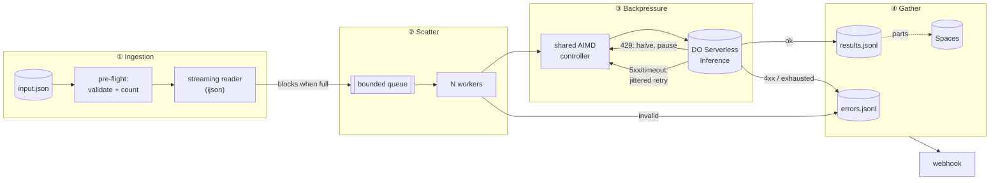

# Batch Inference Engine

A small REST service that takes a JSON file of prompts (1,000 in the sample, 500,000 in the benchmark), fans them out to an LLM endpoint (DigitalOcean Serverless Inference) through a bounded worker pool, and collects every answer. It adapts its own concurrency to the provider's rate limits and isolates bad rows as errors, and none of the items are lost. Memory stays flat whatever the file size.

**Results at a glance**

| | |
|---|---|
| Adaptive controller vs. fixed concurrency (same rate-limited API) | **6.9× faster, 137× fewer 429s** (10.4s vs 71.6s, 6 vs 820) |
| 500,000-item run | **RSS flat at ~65 MB** from item 1 to item 500,000 *(see [Scaling](#scaling-and-memory))* |
| Real 1,000-prompt run on DigitalOcean | *see [Real run](#real-run-on-digitalocean)* |
| Tests | 70 mocked unit + integration tests, CI on Python 3.11–3.13 |

---

## Quickstart

Requires Python 3.11+.

```bash
python -m venv .venv && source .venv/bin/activate
pip install -r requirements-dev.txt

cp .env.example .env            # then set MODEL_ACCESS_KEY (and MODEL if needed)

python scripts/generate_batch.py        # writes data/sample_batch.json (1,000 items, 7 deliberately broken)
uvicorn app.main:app --port 8000
```

In a second terminal:

```bash
# Create a job: returns immediately with a job ID
curl -s -X POST localhost:8000/job -H 'content-type: application/json' \
     -d '{"input_file": "sample_batch.json"}'
# {"job_id":"2aeb...","status":"pending","status_url":"/job/2aeb.../status","download_url":"/job/2aeb.../download"}

curl -s localhost:8000/job/<job_id>/status | jq          # progress, retries, 429s, concurrency, tokens, cost
curl -s localhost:8000/job/<job_id>/download > results.json
curl -s "localhost:8000/job/<job_id>/download?kind=errors" > errors.json
```

Or use the helper script, which creates a job, prints live progress, and saves both files:

```bash
python scripts/run_job.py
```

Run the tests (no API key needed, everything is mocked):

```bash
pytest
```

### Try it without an API key

A fake inference server with a hidden capacity limit, random 500s and random latency is included:

```bash
FAKE_CAPACITY=20 uvicorn scripts.fake_inference_server:app --port 9000 &
INFERENCE_URL=http://127.0.0.1:9000/v1 MODEL_ACCESS_KEY=fake uvicorn app.main:app --port 8000 &
python scripts/run_job.py
```

## API

| Method | Path | Description |
|---|---|---|
| `POST` | `/job` | Body: `{"input_file": "sample_batch.json", "webhook_url": "https://..."}` (both optional). Returns `202` with the job ID. `400` if the file is missing or outside `DATA_DIR`. |
| `GET` | `/job/{id}/status` | Status (`pending`/`running`/`completed`/`failed`), progress, retries, 429 count, current and peak concurrency, items/sec, tokens, estimated cost, error breakdown. `404` if unknown. |
| `GET` | `/job/{id}/download` | Streams the successful results as a JSON array. `?kind=errors` streams the failed items instead. `409` while the job is still running. |
| `GET` | `/health` | Liveness check. |

A result record:

```json
{"index": 17, "id": "p-000017", "prompt": "...", "response": "...",
 "input_tokens": 21, "output_tokens": 38, "attempts": 1, "latency_ms": 412}
```

An error record:

```json
{"index": 154, "id": null, "error_type": "invalid_input",
 "message": "item must be a JSON object, got NoneType", "status_code": null, "attempts": 0}
```

`error_type` is one of `invalid_input` (never sent to the API), `client_error` (a 4xx such as context too long, not retried), `retries_exhausted` (still failing after all retries), or `internal_error`.

`completed` means every item was processed, even if some of them failed. `failed` means the job itself could not run, for example because the file is corrupt or the API key is wrong. Anything written before the failure can still be downloaded.

## Architecture



The full diagram, with every retry path and the crash-recovery loop, is in **[docs/architecture.md](docs/architecture.md)**.

1. **Ingestion.** `POST /job` returns a job ID immediately and starts a background task. The task streams the file once to validate the JSON and count items, so a corrupt file fails before any money is spent. It then streams the file again, one item at a time.
2. **Scatter.** Items go onto an `asyncio.Queue(maxsize=100)`. When the queue is full, the reader's `put()` waits, so the reader can never get ahead of the workers. A fixed pool of `MAX_CONCURRENCY` worker tasks drains the queue.
3. **Backpressure and throttling.** Every HTTP request must hold a slot from one controller shared by all workers. The number of slots adapts: a 429 halves it, successes grow it back, and `Retry-After` pauses everyone. Each failed request is also retried with exponential backoff and full jitter.
4. **Gather.** Each outcome is appended to `results.jsonl` or `errors.jsonl` the moment it finishes. Optionally, new results are uploaded to Spaces in numbered parts. When the job ends, the webhook fires.

| Module | Responsibility |
|---|---|
| [app/main.py](app/main.py) | HTTP endpoints, startup recovery, graceful shutdown |
| [app/jobs.py](app/jobs.py) | Job lifecycle, item validation, metrics, resume |
| [app/reader.py](app/reader.py) | Streaming JSON reader and pre-flight validation |
| [app/workers.py](app/workers.py) | Bounded queue and worker pool |
| [app/rate_limiter.py](app/rate_limiter.py) | Shared adaptive (AIMD) concurrency controller |
| [app/inference.py](app/inference.py) | Chat-completions client, retry policy, backoff |
| [app/storage.py](app/storage.py) | JSONL/meta files, torn-line repair, done-set |
| [app/spaces.py](app/spaces.py) | Progressive upload to DigitalOcean Spaces |
| [app/webhook.py](app/webhook.py) | Completion webhook with retries |

## The adaptive controller (the interesting part)

Per-request exponential backoff alone doesn't cope well with rate limits under parallel load. When 64 workers all get a 429, each one backs off on its own. They then retry at roughly the same time and hit the limit again (a *thundering herd*). Meanwhile concurrency never drops, so the API keeps being overloaded.

This service puts **one controller in front of all workers**. It uses the same idea as TCP congestion control (AIMD, *additive increase, multiplicative decrease*):

- **Slow start.** Until the first 429, every success adds a slot, so the limit roughly doubles each round trip and quickly finds the API's ceiling.
- **Multiplicative decrease.** A 429 halves the limit, never below `MIN_CONCURRENCY`. Each slot is stamped with an *epoch*, and only a 429 from a request sent after the last cut can cut again. This way one burst of 30 simultaneous 429s causes **one** halving, not thirty.
- **Additive increase.** After a 429, the limit grows by 1 per `limit` consecutive successes, about +1 per round trip, never above `MAX_CONCURRENCY`.
- **Retry-After is global.** When the server sends it, *all* new requests pause until that time. Workers don't each sleep for exactly Retry-After, because then they would all wake at the same instant.
- **No slot is held while sleeping.** A worker gives its slot back before it backs off, so retries never block healthy requests.

The two layers do different jobs. The controller decides how many requests may run at once, and each worker's full-jitter backoff decides when its retry happens.

**Measured against the included fake API** (hidden capacity of 20 concurrent requests, 50–250 ms latency, 2% random 500s, same 1,000-item file):

| Strategy | Wall time | 429s | Retries | Throughput | Items lost |
|---|---|---|---|---|---|
| **Adaptive controller** (default, `MAX_CONCURRENCY=64`) | **10.4 s** | **6** | 27 | **96 items/s** | 0 |
| Fixed concurrency 64, per-request backoff only (`MIN=MAX=START=64`) | 71.6 s | 820 | 841 | 14 items/s | 0 |

The controller's limit oscillated between 10 and 20 in the classic AIMD sawtooth, hovering just under the hidden capacity. The theoretical ceiling is about 133 items/s (20 slots ÷ 0.15 s average latency), so the controller reached about 72% of it. The fixed pool spent most of its time being rejected. Its backoff delays grew toward the 30 s cap, which produced a long tail of stragglers at the end.

**429s have their own retry budget.** A 429 means "slow down", not "this item is broken", so it gets `MAX_RATE_LIMIT_RETRIES=20` instead of the `MAX_RETRIES=6` used for 5xx and timeouts. The mocked tests caught this: with a shared budget, an unlucky item that received a few 429s in a row was dropped during a rate-limit storm, which breaks the "without dropping elements" requirement.

### Full retry policy

| Response | Action |
|---|---|
| `200` with a valid body | Success. Grows the concurrency limit. |
| `429` | Halve the limit (once per burst), honor `Retry-After` globally, full-jitter backoff, up to `MAX_RATE_LIMIT_RETRIES` |
| `5xx`, `408`, timeout, connection error, malformed `200` | Full-jitter backoff `random(0, min(30s, 1s·2^n))`, up to `MAX_RETRIES` |
| `401` / `403`, missing key, malformed `INFERENCE_URL` | **Stop the whole job.** Every item would fail the same way. |
| Any other `4xx` (e.g. prompt too long) | Record as an error immediately. Retrying won't help. |
| Invalid item (not an object, missing/empty/non-string prompt, over `MAX_PROMPT_CHARS`) | Record as an error **without calling the API** |

## Real run on DigitalOcean

> **TODO (fill in after the real run):** model used, wall time, items/s, retries, 429s, failures and why, tokens, estimated cost.

```
python scripts/run_job.py   # against inference.do-ai.run with MODEL=<model>
```

**Model choice:** *TODO: the model picked from `GET /v1/models` and why.* The spec suggests a Llama 3 8B instruct model because it is cheap and fast. `MAX_TOKENS=128` keeps both responses and cost small. Switching models only requires changing the `MODEL` env var.

## Scaling and memory

**What happens at 500,000 items?** Memory stays flat. Nothing in the pipeline grows with the number of items:

| Component | Memory | Why |
|---|---|---|
| Reading the input | O(1) | `ijson` streams one item at a time. The file is never loaded whole. |
| Items in flight | O(`QUEUE_SIZE` + `MAX_CONCURRENCY`) | The bounded queue blocks the reader when full, so at most ~164 items exist in memory at any time. |
| Results | O(1) | Each result is appended to disk as soon as it finishes. Nothing accumulates in RAM. |
| Download | O(1) | `StreamingResponse` builds the JSON array line by line from disk. |
| Resume bookkeeping | 1 byte per item | A `bytearray` done-set: 500 KB for 500,000 items, versus ~30 MB for a Python `set[int]`. |
| Counters/metrics | O(1) | Only integers. |

**Measured:** a 500,000-item file (46 MB) against the fake API (capacity 200, 1–5 ms latency, 1% 500s):

> *BENCHMARK RESULTS: filled in below.*

A naive version that does `json.load()` on the file, creates one task per prompt with `asyncio.gather`, and keeps results in a list grows linearly with the input. It holds all 500,000 prompts, 500,000 coroutine objects and 500,000 responses in memory at once, and that is how you get an OOM.

**The results are in completion order, not input order.** Every record carries its input `index`, so the client can sort (`jq 'sort_by(.index)'`). Sorting server-side would require holding every result in memory, or an external merge sort on disk, which defeats the flat-memory design. This is a deliberate trade-off.

**Where the real limits are.** At 500k items the limit is the provider's rate limit and the cost, not memory. Some rough numbers:

- **Throughput** is capped by the provider's rate limit. At, say, 50 concurrent requests and 1 s per request, 500,000 items take about 2.8 hours. The engine itself did about 560 items/s against the local fake API on a laptop, so it is not the bottleneck.
- **Cost** grows linearly: tokens × price. `MAX_TOKENS` is the main lever.
- **Disk:** about 0.5–1 KB per result record, so roughly 250–500 MB for 500,000 results, prompts included.
- **One process, one event loop.** A single asyncio process handles hundreds of concurrent HTTP requests because the work is almost entirely waiting on the network. The CPU cost is JSON encoding and decoding, which is also where the ~560/s ceiling of this benchmark comes from.

**When to go multi-machine.** Scale out when either (a) one account's rate limit is no longer the bottleneck and a single process's CPU is, around 1,000 requests/s, or (b) jobs need to survive the machine itself dying and be picked up by another. The design then changes to:

- a shared durable queue (SQS, Redis Streams, or DO Managed Kafka) replacing the in-process queue;
- stateless workers across machines;
- a shared rate-limit budget (e.g. a token bucket in Redis) replacing the in-process controller;
- job state in Postgres instead of `meta.json`;
- results in Spaces instead of local disk.

The interfaces stay the same: *reader → queue → worker → controller → client → writer*.

## Reliability

- **Crash recovery.** Results are appended and flushed per item. On startup the service reloads every job from `output/*/meta.json` and **resumes** any that were `pending` or `running`, skipping indexes already present in `results.jsonl`/`errors.jsonl`. If a crash tore the last line of a file, that line is truncated before appending, so the next record never gets glued onto it. Delivery is **at-least-once**: after a power loss, the last few un-synced lines are simply re-run.
- **Tested with a real `kill -9`.** A 1,000-item job was killed at 159 items done. On restart it resumed automatically and finished with exactly 1,000 unique records (993 ok, 7 invalid inputs): nothing lost, nothing duplicated.
- **Graceful shutdown.** On SIGTERM, running jobs are cancelled but left marked `running` on disk, so the next start resumes them.
- **Atomic metadata.** `meta.json` is written to a temp file and renamed, so it is never half-written.
- **Spaces upload (extension).** If `SPACES_*` is configured, every `SPACES_PART_SIZE` results the newly written bytes of `results.jsonl` are uploaded as `results/part-NNNNN.jsonl`. Concatenating the parts reproduces the file exactly. At the end `errors.jsonl` and `meta.json` are uploaded too. The upload offset is saved in `meta.json`, so after a resume the part numbering continues where it left off. `boto3` runs in a thread so it never blocks the event loop. A failed upload is logged and retried with the next part, and it never fails the job.
- **Webhook (extension).** When a job finishes, the job summary plus `download_url` is POSTed to `webhook_url`. 5xx responses and network errors are retried with backoff. A 4xx from the receiver is not retried. A failed webhook never changes the job's result.
- **Input path safety.** `input_file` is resolved and must stay inside `DATA_DIR`. `../../etc/passwd` gets a `400`.

## Design decisions

| Decision | Chosen | Rejected | Why |
|---|---|---|---|
| Rate limiting | Shared AIMD controller + per-request full-jitter backoff | Per-request backoff only | Per-request backoff causes a thundering herd and never reduces concurrency. The benchmark above shows the difference: 6.9× faster, 137× fewer 429s. |
| Result order | Completion order, each record has `index` | Sorted by input order | Sorting needs everything in memory (or a disk merge sort). Clients can sort trivially. |
| Storage | Local JSONL + `meta.json`, optional Spaces | A database | Append-only JSONL is streamable, crash-tolerant and dependency-free. A single-node service doesn't need a DB. Spaces covers machine loss. |
| Queueing | In-process `asyncio.Queue` | Redis / Celery / Kafka | One process with an in-memory queue and disk checkpoints is simpler and enough for one server. A shared queue is only worth adding for multiple machines (see above). |
| Concurrency model | asyncio, one process | Threads / multiprocessing | The work is ~99% waiting on network I/O. asyncio handles hundreds of concurrent requests with a single thread and no locks around shared counters. |
| Corrupt file | Pre-flight streaming validation pass | Fail midway | A second streaming read of the file is cheap (measured: 0.18 s and 15 MB peak for the 46 MB, 500k-item file) and avoids paying for half a job on a broken file. It also gives `status` a real total. |
| Oversized prompts | Rejected locally (`MAX_PROMPT_CHARS`) | Let the API reject them | Saves a paid round trip. The API's own 4xx is still handled as a non-retryable error. |
| Auth errors | Stop the job on 401/403 | Treat as a per-item error | Otherwise a typo in the key would burn through 1,000 failures. |
| Build vs. managed batch API | Built | Provider batch endpoints | A managed batch API is the right call when a 24-hour turnaround is fine and you want the discount. This service gives real-time progress, control over retries and concurrency, per-item error isolation, webhooks, and works against any OpenAI-compatible endpoint. |

## Testing

```bash
pytest -v
```

70 tests, all offline. The inference API is mocked with `respx`, because a 429 or 500 is something the *server* sends. No prompt can trigger one, and a real API won't produce them on demand. Mocks can produce exact failures on command, for free, in milliseconds, in CI. Backoff delays are configured to milliseconds in tests.

| File | What it proves |
|---|---|
| `test_inference.py` | Success; 429 → success; many 429s → success; 429s have their own budget; `Retry-After` honored; 500/503 → success; persistent 500 gives up after `MAX_RETRIES`; timeouts and connection errors retried; malformed body retried; 400 not retried; 401/403 raise immediately; **no slot held while backing off**; backoff is full jitter and capped; `Retry-After` parsing (seconds, HTTP date, cap) |
| `test_rate_limiter.py` | Halves on 429; floor at min; **one burst = one cut**; slow start; additive increase; ceiling at max; blocks at limit; after a cut, new requests wait for in-flight to drain; `Retry-After` pauses everyone |
| `test_workers.py` | Every item handled once; skip set honored; pool is bounded; **reader can't run ahead of workers** (backpressure); a fatal error cancels everything |
| `test_reader_storage.py` | Streaming indexes; empty array; truncated / invalid / non-array / empty file rejected; append + read back; **torn last line repaired**; atomic meta; done-set |
| `test_jobs.py` | **succeeded + failed = total, no duplicates**; invalid items never hit the API; oversized prompts rejected locally; persistent failures isolated; **rate-limit storm loses nothing**; every request holds a slot; bad key stops early; corrupt file fails with zero API calls; **resume after crash skips finished items**; finished jobs reload without re-running; Spaces parts concatenate to the exact file; Spaces or webhook failures don't fail the job; webhook payload + retry; path traversal rejected |
| `test_api.py` | Full flow through HTTP (create → poll → download results and errors); `POST` returns before work finishes; `409` while running; `404` unknown; `400` bad path; `422` bad webhook URL; failed jobs still downloadable |

CI ([.github/workflows/ci.yml](.github/workflows/ci.yml)) runs the full suite on every push against Python 3.11, 3.12 and 3.13.

## Configuration

All settings are environment variables (or `.env`). See [.env.example](.env.example).

| Variable | Default | Meaning |
|---|---|---|
| `MODEL_ACCESS_KEY` | – | DigitalOcean model access key (required) |
| `INFERENCE_URL` | `https://inference.do-ai.run/v1` | Any OpenAI-compatible base URL |
| `MODEL` | `llama3-8b-instruct` | Model ID |
| `MAX_TOKENS` | `128` | Max output tokens per prompt |
| `MAX_CONCURRENCY` | `32` | Ceiling for the adaptive limit, and the number of workers |
| `MIN_CONCURRENCY` / `START_CONCURRENCY` | `1` / `8` | Floor and starting point of the adaptive limit |
| `QUEUE_SIZE` | `100` | Items buffered between reader and workers |
| `MAX_RETRIES` | `6` | Retries for 5xx, timeouts, connection errors |
| `MAX_RATE_LIMIT_RETRIES` | `20` | Retries for 429s |
| `REQUEST_TIMEOUT` | `60` | Seconds per request |
| `MAX_PROMPT_CHARS` | `32000` | Local guard against oversized prompts |
| `DATA_DIR` / `OUTPUT_DIR` | `data` / `output` | Where inputs are read from and job files are written to |
| `PRICE_INPUT_PER_M` / `PRICE_OUTPUT_PER_M` | `0` | USD per 1M tokens, for the cost estimate |
| `SPACES_BUCKET`, `SPACES_REGION`, `SPACES_KEY`, `SPACES_SECRET`, `SPACES_PART_SIZE` | off | Progressive upload to Spaces (enabled when bucket + key + secret are set) |

## What I'd do next

- **Multiple machines:** a shared durable queue, stateless workers, a distributed rate-limit budget, and Postgres for job state (see [Scaling](#scaling-and-memory)).
- **Security:** API authentication and per-tenant quotas. Webhook URLs currently allow SSRF, so resolve them and block private or metadata IP ranges, and sign payloads with HMAC so receivers can verify them.
- **Per-tenant rate limits and priorities**, so one large job can't starve the others.
- **Token-aware throttling:** providers also limit tokens per minute, not just requests. The controller could budget on estimated tokens.
- **Cancel endpoint** (`DELETE /job/{id}`) and job retention/cleanup.
- **Observability:** Prometheus metrics (in-flight, limit, 429 rate, latency histograms) and a small dashboard.
- **Upload an input file** via `POST` (multipart, or a Spaces URL) instead of only reading from `DATA_DIR`.
- **Output ordering option:** an external merge sort by `index` for callers who need input order.
