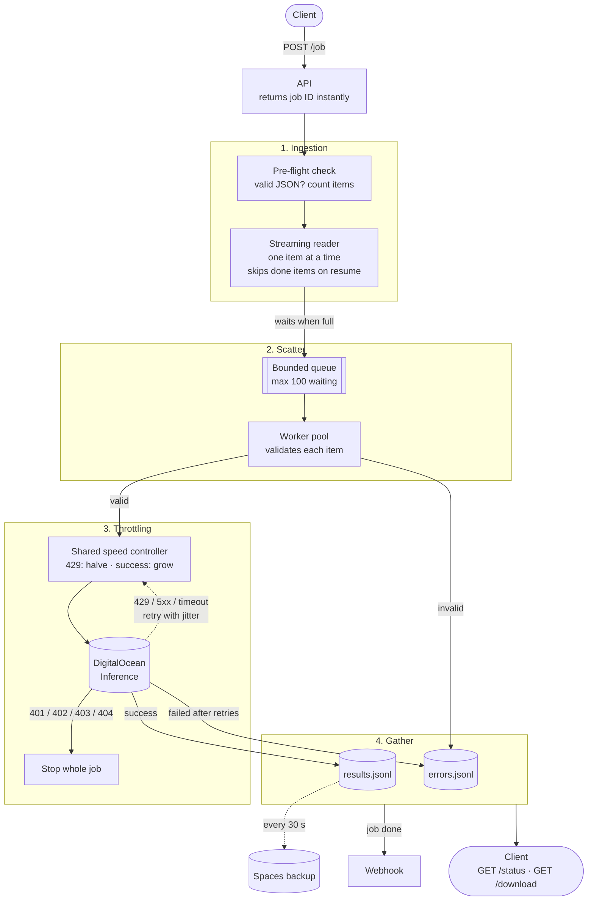

# Architecture

## Walkthrough

1. **Ingestion.** `POST /job` checks that the input file sits inside `DATA_DIR`, writes `meta.json`, starts a background task, and returns the job ID. The task first streams the file once to validate it and count items. A corrupt file fails here, before any money is spent. It then streams the file again, handing out `(index, item)` pairs one at a time. After a restart, indexes already in the JSONL files are skipped.
2. **Scatter.** The reader puts items on a bounded queue. When the queue is full, the reader waits, so it can never run ahead of the workers. That is the backpressure that keeps memory flat. A fixed pool of worker tasks pulls from the queue. Invalid items go straight to `errors.jsonl` without an API call.
3. **Backpressure and throttling.** Before each HTTP request a worker takes a slot from the shared controller, and it gives the slot back as soon as the response arrives, including before it sleeps for a retry. A 429 halves the number of slots, once per burst, and `Retry-After` pauses every worker. Successes add slots back. 5xx responses and timeouts are retried with full-jitter backoff. Other 4xx errors are not retried. A 401 or 403 (bad key), 402 (no billing) or 404 (unknown model or wrong URL) stops the whole job at once, because every item would fail the same way.
4. **Gather.** Each outcome is appended to `results.jsonl` or `errors.jsonl` as soon as it happens. Optionally, every `SPACES_FLUSH_SECONDS` (default 30) the newly written bytes are uploaded to Spaces as the next numbered part. Nothing is uploaded if nothing new was written. `meta.json` is written every 2 seconds and at the end. When the job finishes, the webhook fires. `download` streams the JSONL back as one JSON array, never holding it all in memory.
